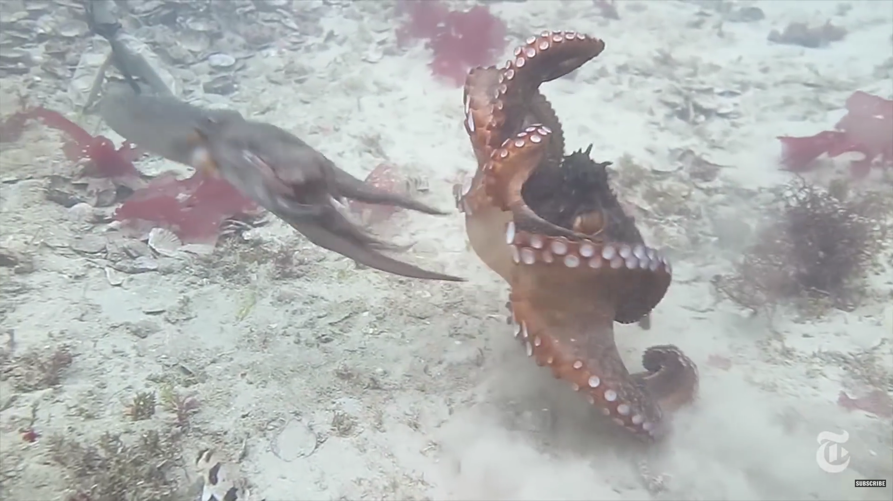
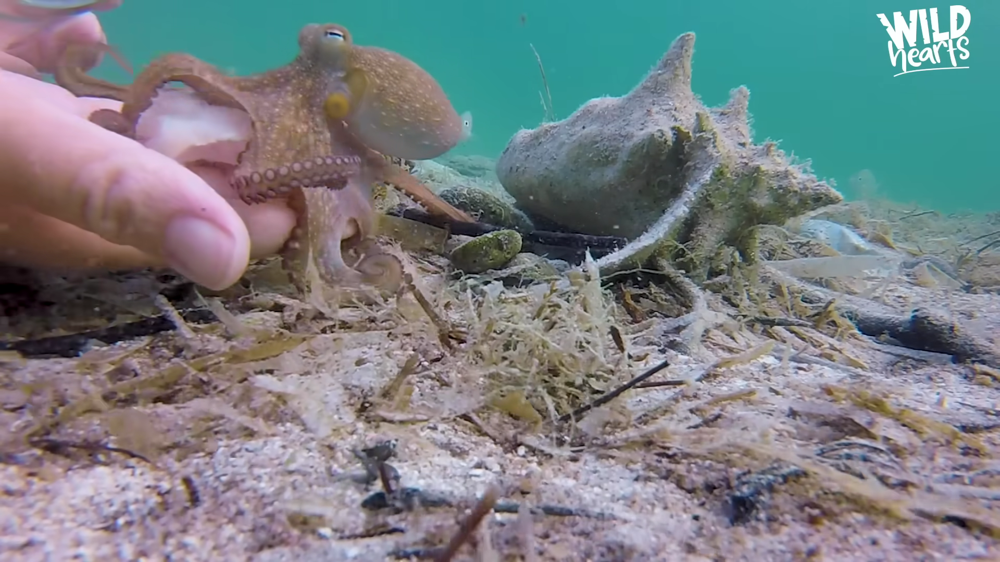
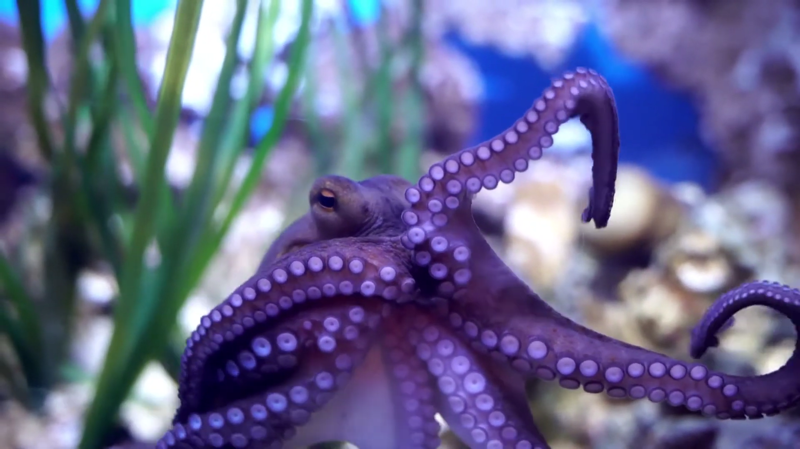
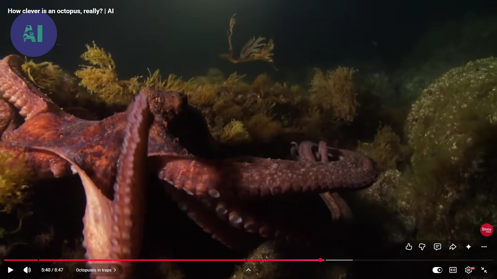

# Cephalopod Behavioral Captioning — Status Report
**Project:** *O. vulgaris* (Nity) Behavioral Analysis  
**Last Updated:** 2026-06-13  
**Author:** Siddharth Raj

---

## Week of 2026-06-09 — Update

### What We Did

#### 1. Ethogram Clip Extraction (exp12 → exp13)

Built and ran a full pipeline to extract 15-second clips for every event in `data/Nity events.csv` (119 rows). Two iterations:

- **exp12** (`phase2/exp12_ethogram_clips.py`): First attempt. Used MOG2 peak-motion within ±2.5 min of event time. Had two bugs: (a) "all day" events were wrongly anchored to 10:00am, (b) the wide scan window picked up motion from unrelated nearby events. Produced 66 clips but many were mismatched.
- **exp13** (`phase2/exp13_ethogram_clips_v2.py`): Fixed version. Tightened window to ±2 min, properly skipped all 53 "all day" / "morning and afternoon" events with no anchor time. Re-ran from scratch. Produced **39 clips** in `data/clips/ethogram_v2/`.

Pipeline per event: find segment on server → download 30-min video → scan ±2 min for peak MOG2 motion → extract 15s clip → delete raw video immediately (disk efficient).

**Final results:**

| Status | Count | Reason |
|---|---|---|
| Extracted | 39 | Clips saved to `data/clips/ethogram_v2/` |
| Skipped — no anchor | 54 | "all day" / "morning and afternoon" (no reliable time) |
| Skipped — dark/IR | 11 | Camera in IR mode at event time (brightness < 100) |
| Skipped — not on server | 5 | Dates before recording started |
| Skipped — unparseable | 1 | "17??++" in CSV |

Output index: `data/ethogram_clips_v2.json` — one entry per CSV row with clip path, motion score, segment, and session.

#### 2. Video Captioning with Qwen2-VL-2B (Local)

Installed `mlx-vlm` and ran `Qwen2-VL-2B-Instruct-4bit` (Apple MLX, ~1.5GB RAM) locally to generate timestamped behavioral descriptions from video frames.

- Extracts 1 frame every 30 seconds from a clip
- Runs the vision-language model on each frame individually (keeps peak RAM ~2.2GB)
- Outputs a JSON with timestamped captions

**Test run** on Right Back camera, 2026-03-07 12:36–12:41 ("Joystick light; caister" event):

```
[00:00] Nity is extending arms, interacting with a blue water bottle on the ground.
[01:00] Nity is with arms extended, possibly reaching toward equipment on tank floor.
[01:30] Nity is extending arms, interacting with objects on a shelf. Arms raised, relaxed posture.
[02:00] Nity is extending arms, interacting with an elderly man.
[04:00] Nity is extending arms, vibrant coloration, interacting with a computer keyboard.
```

Caption JSON saved to `data/clips/ethogram_v2/20260307_123002_captions.json`.

Script: `/tmp/describe_video_light.py` (to be moved into `phase2/` next week).

#### 3. Key Technical Fixes This Week

| Issue | Fix |
|---|---|
| `head -80` pipe killed extraction script early | Re-ran without pipe, logged to file |
| mlx-vlm `image=` param rejected .mp4 files | Switched to `video=` param |
| 7B model crashed 16GB laptop | Downgraded to 2B + one-frame-at-a-time inference |
| `GenerationResult` not JSON serializable | Extract `.text` field before saving |
| Model echoed prompt structure in output | Rewrote prompt to force direct first-person observation |

---

## Next Week — Plan

### Priority 1 — Caption all 39 ethogram clips

Move `/tmp/describe_video_light.py` into `phase2/exp14_caption_clips.py`. Run it over all clips in `data/clips/ethogram_v2/`. Save a sidecar `<clip_name>_captions.json` next to each clip, and a combined `data/ethogram_captions.json` index mapping clip → captions → ethogram metadata.

Estimated time: ~3 min per clip × 39 clips = ~2 hours unattended.

### Priority 2 — Improve caption quality

The 2B model is generic ("sitting on shelf", hallucinated "shell"). Two options to improve:
- **Better prompt engineering**: include camera angle (Right Back = side view), tank layout description, known objects (den, bridge, canister, joystick)
- **7B model**: run overnight when laptop is plugged in and no other apps open (needs ~4.5GB free RAM)

### Priority 3 — Recover the 10 skipped Sept 2025 clips

The last 10 events (Sept 17 – Oct 2 2025) were marked `manually_skipped_slow_download`. Re-run exp13 on just those events when on a faster connection.

### Priority 4 — Build final JSON dataset

Merge `ethogram_clips_v2.json` + captions into one unified dataset file:
```json
{
  "date": "2026-03-07",
  "event": "Joystick light; caister",
  "clip_path": "data/clips/ethogram_v2/...",
  "ethogram_details": "...",
  "captions": [
    {"time": "00:00", "description": "Nity is extending arms..."},
    ...
  ]
}
```

This is the deliverable that connects raw footage → behavioral label → visual description.

---

## 1. Project Goal

Build a pipeline that takes aquarium footage of octopus Nity (*O. vulgaris*) and outputs:
- Confirmed clip segments where the octopus is visibly present
- Behavioral labels (ethogram categories) via unsupervised clustering
- Descriptive captions generated by a fine-tuned vision-language model

The pipeline runs end-to-end: **Detection → Feature Extraction → Clustering → Labeling → Caption Model**.

---

## 2. What We've Built

### Stage 1 — Detection Pipeline (Complete)

We built two detection approaches for identifying octopus presence in 30-minute, 658MB remote video files without downloading them in full.

#### Approach A: CLIP Zero-Shot Scoring

A CLIP (ViT-B/32) scanner streams frames via ffmpeg HTTP at 0.2 fps and scores each frame against two text prompts using a softmax:

```
"an octopus in an aquarium tank"          → P(octopus)
"empty aquarium tank with rocks and no animals"
```

Key implementation:
- **MPS support** (Apple Silicon GPU) for inference
- **ffmpeg pipe** instead of cv2 seeking — 30× faster (4.5 min vs 30+ min for 6 cameras)
- **Majority vote** across 6 cameras (≥2/6 must detect) to reduce false positives
- **Threshold = 0.70**, **min_duration = 30s** to filter human walk-bys

#### Approach B: GroundingDINO Bounding-Box Detection

Zero-shot object detector that returns bounding boxes for query `"octopus"`. More precise than CLIP — gives spatial location, not just a score. Runs CPU-only on Mac (custom CUDA ops not compiled for MPS). Verified at **2.19 s/frame**.

---

### Stage 2 — Sample Frame Corpus (Complete)

We collected 28 reference frames from public octopus videos covering key behavioral states. These were used to validate the segmentation pipeline and will seed the hand-labeled eval set.

**Raw frames (octo-images/):**

| Camouflage resting | Locomotion / swimming | Tool use / manipulation |
|---|---|---|
|  |  |  |

| Aquarium foraging | Alert posture | Open water |
|---|---|---|
|  |  |  |

---

### Stage 3 — Segmentation (Complete on Sample Corpus)

We ran GroundingDINO + SAM-based segmentation on all 28 reference frames. The octopus mask is extracted per frame with confidence scores.

**Raw frame → Segmentation mask:**

| Raw | Segmented |
|---|---|
|  |  |
|  |  |
|  |  |
|  |  |

The segmentation correctly isolates the octopus body across:
- Cryptic camouflage against substrate (img-1)
- High-motion hunting/locomotion scenes (img-5)
- Aquarium tank close-ups (img-15, img-25)

---

### Stage 4 — Remote Aquarium Scan (In Progress)

We scanned the live remote server at `repo.octopus-intelligence.org/public` for subject session `O-vulgaris-Nity-2026-2-20--`, covering 6 cameras per 30-minute recording.

**Camera layout:**

```
Left Top    Right Top
Left        [TANK]    Right Back
            Right Left
            Right Front   Right Right
```

**CLIP scores for scanned timestamps:**


**Key findings from the score plots:**

| Camera | Mean Score | Behavior |
|---|---|---|
| Left Top (2026-02-20, 0854) | ~0.15 | Low baseline — reliable signal |
| Left Top (2026-02-20, 0924) | Low with spike at ~23 min | One detection event |
| Right Top (2026-02-20, 0924) | ~0.85 persistent | **Per-camera bias — always high** |
| Left Top (2026-02-21, early) | ~0.50 → drops | Early morning, octopus inactive |

**Right Top camera is unreliable** — scores persistently above threshold regardless of octopus presence (same issue as Right Back and Right Right). This is a per-camera baseline bias, not actual detection.

**Reliable cameras:** Left Top (mean ≈ 0.15–0.25), Right Front (mean ≈ 0.12).

---

### Stage 5 — Downloaded Segments (Complete for 1 Timestamp)

We downloaded confirmed segments for timestamp `092420` (2026-02-20, 09:24 AM) across all 6 cameras:

```
data/aquarium/2026-02-20/092420--vv-1/
├── Left_Top_1400_1445.mp4       (45s segment)
├── Right_Back_1400_1445.mp4
├── Right_Front_1400_1445.mp4
├── Right_Left_1400_1445.mp4
├── Right_Right_1400_1445.mp4
└── Right_Top_1400_1445.mp4
```

**Note:** The detection at t=1400–1445s corresponds to a human aquarist entering the frame, not octopus presence. CLIP correctly fires on the movement event but cannot distinguish human vs. octopus at this threshold. Fix: `min_duration=30s` filters brief human walk-bys; sustained octopus presence is longer.

---

## 3. Known Issues & Fixes Applied

| Issue | Root Cause | Fix |
|---|---|---|
| cv2 frame seeking takes 30+ min | Decodes all intermediate frames | Switched to ffmpeg pipe at 0.2fps |
| Right Back / Right Right always detect | Per-camera baseline bias | Rely on Left Top + Right Front for signal |
| Human walk-bys trigger CLIP | CLIP is motion-sensitive, not species-specific | `min_duration=30s` filters transient detections |
| GroundingDINO parallel scan dies silently | ProcessPoolExecutor + CPU autocast conflict | Not yet resolved; fallback to sequential |
| Right Right audio codec (pcm_alaw) | ffmpeg `-c copy` fails for this camera | `-c:v copy -c:a aac` re-encodes audio only |

---

## 4. Current Data State

| Location | Contents | Status |
|---|---|---|
| `octo-images/` | 28 reference frames from YouTube | ✅ Done |
| `segmented-output/` | 28 segmented frames with masks | ✅ Done |
| `data/clips/` | Extracted clip frames (YouTube corpus) | ✅ Done |
| `data/phase2/scores/` | CLIP score arrays (.npz) for 5 remote scans | ✅ Done |
| `data/aquarium/2026-02-20/092420--vv-1/` | 6 × 45s segments (flagged: human FP) | ⚠️ False positive |
| Confirmed octopus segments | — | ❌ 0 confirmed |

---

## 5. Next Steps

### Immediate (to get confirmed octopus data)

1. **Run scanner on 09:00–17:00 window for 2026-02-20** — skip early morning (octopus inactive before 09:00). Focus detection on Left Top + Right Front cameras only (low baseline bias).
2. **Raise min_duration to 60s** — this further eliminates human walk-bys while catching sustained octopus sessions.
3. **Visual inspection of Left Top score spike at t≈23 min** in the 0924 scan — this is the most promising unverified detection.

### Medium Term (once ≥10 confirmed clips)

4. **DINOv2 feature extraction** — run `dinov2_vitb14` on confirmed segments, extract 768-d clip vectors
5. **KMeans / HDBSCAN clustering** — group clips into 8–15 behavioral clusters
6. **Manual label 3–5 representatives per cluster** — map to ethogram categories (resting, foraging, locomotion, camouflage, inking, etc.)
7. **Label propagation** — assign cluster labels to all clips

### Long Term

8. Train caption model (BLIP-2 / LLaVA style) on labeled clips
9. Evaluate against gold-standard hand-labeled set
10. Optional: distill to mobile-ready model for field deployment

---

## 6. Architecture Summary

```
Remote Server (6TB footage)
        │
        ▼ ffmpeg HTTP stream at 0.2fps
┌─────────────────────┐
│  CLIP / GDino scan  │  ← 6 cameras in parallel threads
│  Threshold = 0.70   │  ← Majority vote (≥2/6)
│  min_duration = 30s │
└─────────────────────┘
        │ confirmed timestamps
        ▼ ffmpeg download (segment only)
┌─────────────────────┐
│  data/aquarium/     │  ← one folder per timestamp
│  6 × .mp4 per folder│
└─────────────────────┘
        │
        ▼
┌─────────────────────┐
│  DINOv2 features    │  ← 768-d vectors per clip
│  PCA → clustering   │  ← HDBSCAN / KMeans
│  Manual labeling    │  ← 3-5 reps per cluster
└─────────────────────┘
        │
        ▼
┌─────────────────────┐
│  Caption model      │  ← encoder → projection → LLM
│  (BLIP-2 / LLaVA)  │
└─────────────────────┘
        │
        ▼ "Octopus resting in den, arms tucked, textured skin matching substrate"
```

---

*Report generated 2026-06-06. Images in `octo-images/` and `segmented-output/` are relative to project root.*
