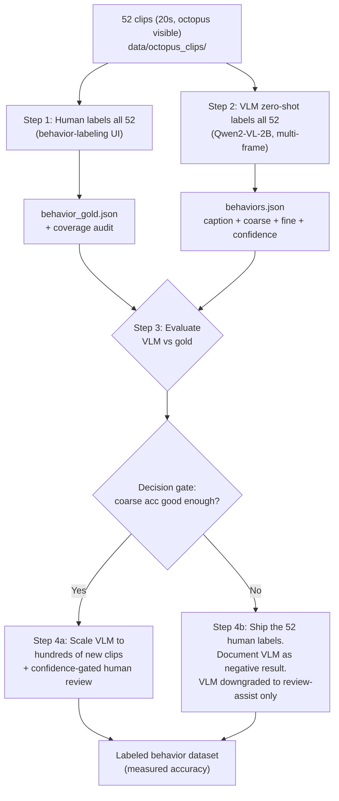
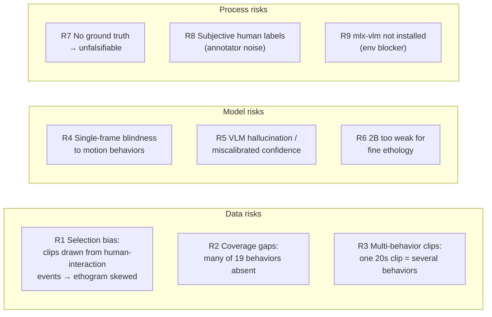
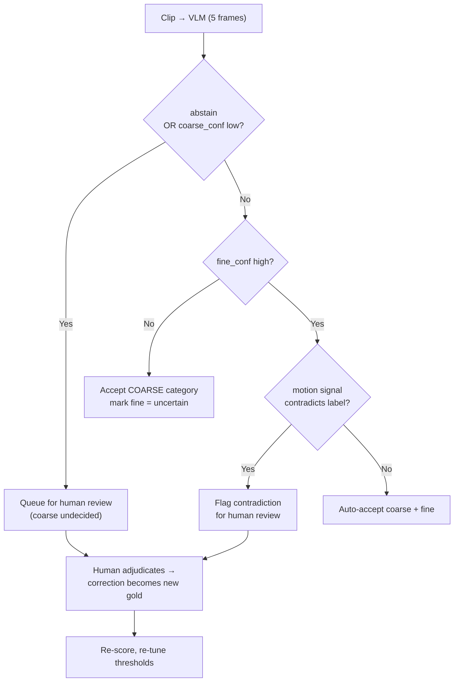
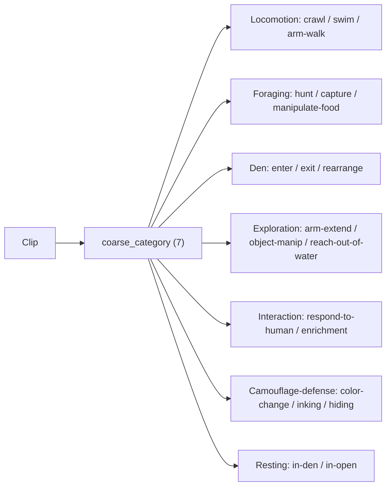

# Phase 2 Plan — Octopus Behavior Classification

**Subject:** *O. vulgaris* "Nity" — aquarium security-camera footage
**Goal:** Given a short clip of the octopus, output which **ethogram behavior** it is showing.
**Hard constraints:** No labeled behavior data. No API budget. Local compute only (Apple Silicon, 2B VLM).

---

## 1. Context — why this plan exists

Phase 1 solved *presence*: a CLIP+MLP classifier (98.1% acc) tells us whether the octopus is visible. Using it, `exp18` extracted **52 clips × 20s** where the octopus is confirmed visible (`data/octopus_clips/`).

We are now at the **behavior** step — not "is it here?" but "**what is it doing?**" — mapping each clip to one of 19 ethogram behaviors (`data/ethogram_list.json`), grouped into 7 coarse categories.

The defining fact: **there are zero ground-truth behavior labels in the repo.** Nothing is mapped to the ethogram. So this cannot be a "train a classifier" project — it is a **VLM-assisted annotation** project, and its success must be *measured*, not assumed.

---

## 2. The reframe that drives the best plan

With only **52 clips**, a human can label all of them in ~1–2 hours. So for *this batch*, a VLM is nearly redundant — we could just label them by hand and be done.

The VLM's real value is **scaling to the next hundreds of clips** that Phase 1 can extract. Therefore:

> **The 52-clip VLM run is not the deliverable. It is a *validation gate* that decides whether the VLM is trustworthy enough to scale.**

And the human labeling pass does **double duty**: it is both the **gold eval set** *and* a **coverage audit** that answers a prior question nobody has checked — *does the 19-behavior ethogram even apply to this footage?*

This reframe turns a fuzzy "run a model and hope" into a falsifiable experiment with a clear go/no-go decision.

---

## 3. Pipeline overview



The VLM run (C) never sees the gold labels (B) — it stays genuinely zero-shot. Gold is used only to score it.

---

## 4. What will work / what won't

### Will work
- **Human gold set of 52 clips** — cheap, and the keystone that makes everything measurable.
- **Coarse 7-category zero-shot labeling** — the 7 categories are visually distinct; a 2B VLM can call them with usable reliability.
- **Multi-frame input** — sampling ~5 frames across the clip lets the VLM see change, not just a pose.
- **Confidence-gated weak labeling** — auto-accept high-confidence labels, route the rest to a human.

### Won't work (explicit non-goals)
- **Single-frame classification** (the current `exp21` flaw — it samples only t=10s). ~Half the ethogram is motion-defined and invisible in one still: locomotion (crawl/swim/arm-walk), den **enter vs exit** (direction), hunting/capturing (events), color-change & inking (temporal). → **Fix: multi-frame.**
- **Reliable 19-way fine labels as the headline** — too noisy zero-shot. Emit fine only, confidence-gated, as a secondary output.
- **Direction pairs from sparse frames** (enter/exit den, approach/retreat) → collapse to parent for scoring.
- **Supervised / fine-tuned classifier** — <3 examples per class even if labeled. Nothing to train on.
- **Unsupervised clustering at n=52** — clusters track camera/lighting/background, not behavior.
- **Trusting `Nity events.csv` timestamps** — weak prior + spot-check only.

---

## 5. Risk analysis



| # | Risk | Impact | Likelihood | Mitigation |
|---|------|--------|-----------|------------|
| R1 | **Selection bias** — clips come from logged human-interaction events | High | High | Coverage audit during gold labeling; report which categories are present; don't claim ethogram-wide accuracy |
| R2 | **Coverage gaps** — inking/swimming/hunting likely absent | Med | High | Report per-category support counts; rare classes are review-only, never auto-accepted |
| R3 | **Multi-behavior clips** — a clip contains several behaviors | Med | Med | Label/predict the **dominant** behavior; allow optional secondary label in gold |
| R4 | **Single-frame blindness** to motion behaviors | High | Certain (current code) | **Multi-frame sampling** (5 frames) + `motion_evidence` field in output |
| R5 | **VLM hallucination / bad confidence** | High | High | Independent motion-signal cross-check; gold-calibrated thresholds; abstain option; confidence used only to *rank* review order |
| R6 | **2B too weak** for fine distinctions | Med | High | Coarse-first headline; fine gated by confidence; document where it fails |
| R7 | **No ground truth** → can't measure | Critical | Certain | **Gold set (Step 1) is the mitigation** — built before any tuning |
| R8 | **Subjective human labels** | Med | Med | Double-label ~15 clips → inter-annotator agreement = the ceiling VLM is judged against |
| R9 | **mlx-vlm not installed** in `./venv` | Blocker | Certain | Install + smoke-test on 3 clips before full run |

**Top risk:** R1+R7 together. If the 52 clips only cover 5–6 behaviors and we have no gold, any "accuracy" number is meaningless. Both are killed by doing the **human gold + coverage audit first**.

---

## 6. Per-clip routing (the weak-labeling loop)



Thresholds are **chosen from the gold accuracy-vs-coverage curve**, not guessed. Humans only touch the flagged minority.

---

## 7. Coarse → fine hierarchy (output schema)



VLM emits, per clip:
```json
{
  "caption": "...posture, arms, color, motion across frames, objects/people...",
  "coarse_category": "<one of 7 | unknown>",
  "fine_label": "<child of coarse_category | uncertain>",
  "coarse_confidence": 0.0,
  "fine_confidence": 0.0,
  "abstain": false,
  "motion_evidence": "what changed between frames, or 'no change observed'"
}
```

---

## 8. Work plan

### Step 0 — Unblock environment
Install `mlx-vlm` + Qwen2-VL deps into `./venv`; smoke-test load + one `generate` call. (ffmpeg/ffprobe already present.)

### Step 1 — Human gold set + coverage audit (do first)
Extend `ui/labeler.py` with a **behavior-labeling mode** (reuse its video player, timeline, dark CSS, `_lock`+`_save` JSON API):
- Routes: `GET /api/clips` (from `manifest.json`), `GET/POST/DELETE /api/behavior_labels` → `data/octopus_clips/behavior_gold.json`, `/clip/{name}` to serve local mp4.
- UI per clip: coarse dropdown (7) → fine dropdown filtered to that category's children; **"uncertain"**, **"motion-only"**, and optional **secondary label** checkboxes.
- Human labels all 52. Double-label ~15 (second pass) → agreement ceiling.
- **Output the coverage audit:** counts per category → confirms which behaviors actually exist here.

### Step 2 — Fix + run VLM (`phase2/exp21_caption_clips.py`)
- Replace single-midpoint frame with **5-frame sampling** (t≈1,6,10,14,19s) via exp14's ffmpeg `-ss` pattern; pass via `apply_chat_template(..., num_images=5)` + `generate(image=[...])`.
- **Hierarchical prompt:** coarse first, then fine constrained to that category's children (built from the `category` field in `ethogram_list.json`).
- **Defensive parse:** try `json.loads`, fall back to existing line-parser. Keep resumable save-after-each-clip loop.
- Output → `data/octopus_clips/behaviors.json`.

### Step 3 — Evaluate (`phase2/exp22_eval_behavior.py`, new, stdlib, read-only)
Join `behaviors.json` ↔ `behavior_gold.json` by filename:
- Coarse 7-way accuracy; fine accuracy on confident gold; per-category confusion matrix.
- **Accuracy-vs-coverage curve** over the confidence threshold.
- Motion-contradiction count via `phase2/motion_detector.py` / `exp16` (e.g. motion≈0 but label="swimming").

### Step 4 — Decision gate
- **If coarse accuracy clears the bar** (target: well above 14% random, and within reach of the human ceiling): scale VLM to new clips with confidence-gated human review (Step 4a).
- **If not:** ship the 52 human labels as the dataset; document the VLM as a negative result and downgrade it to review-assist (Step 4b). Both are valid, honest outcomes.

---

## 9. Files
| File | Action |
|---|---|
| `ui/labeler.py` | Extend — behavior-labeling mode + clip-serving routes |
| `phase2/exp21_caption_clips.py` | Modify — multi-frame, hierarchical JSON prompt, `behaviors.json` |
| `phase2/exp22_eval_behavior.py` | New — eval metrics (read-only) |
| `data/octopus_clips/behavior_gold.json` | New — human gold labels + coverage |
| `data/octopus_clips/behaviors.json` | New — VLM output |
| `data/ethogram_list.json` | Read — 7 categories + 19 children |
| `phase2/exp14_caption_clips.py` | Reference — multi-frame ffmpeg pattern |

---

## 10. Verification
1. **UI:** all 52 clips load/play; labeling writes `behavior_gold.json` live.
2. **VLM:** `--max-clips 3` first → valid JSON, in-taxonomy labels; then full run → 52 entries.
3. **Eval:** coarse accuracy meaningfully above 14% baseline; readable confusion matrix; usable coverage curve.
4. **Sanity:** spot-check 5 VLM-vs-gold disagreements; confirm human ceiling sits above VLM accuracy.

## 11. Definition of done
- 52 clips have human gold + VLM labels; coverage audit recorded.
- A measured coarse-accuracy number (confusion matrix + coverage curve) exists in the status report.
- Decision gate resolved (scale, or ship-human-labels) with rationale.
- Honest write-up: where the VLM works (coarse / static postures) vs fails (motion/direction behaviors).
