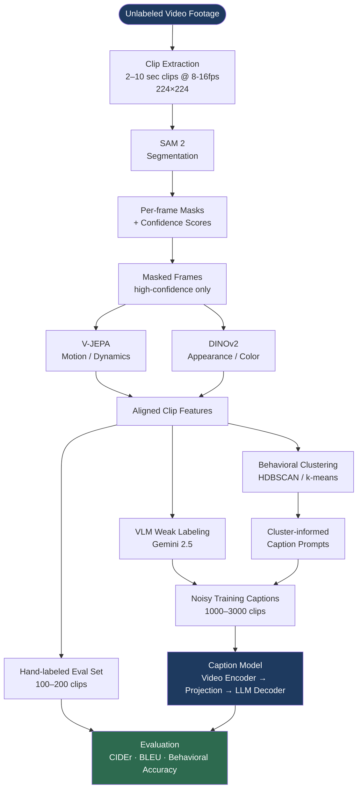
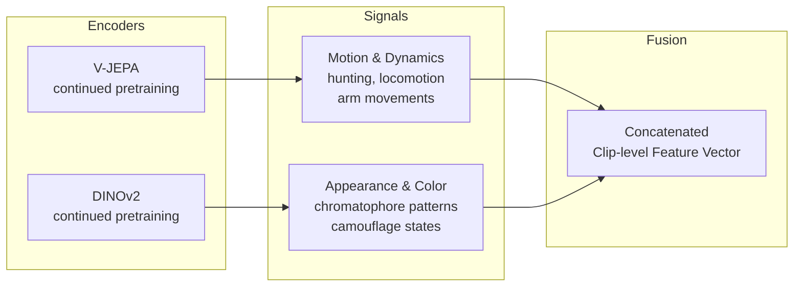
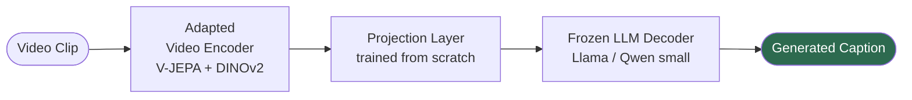
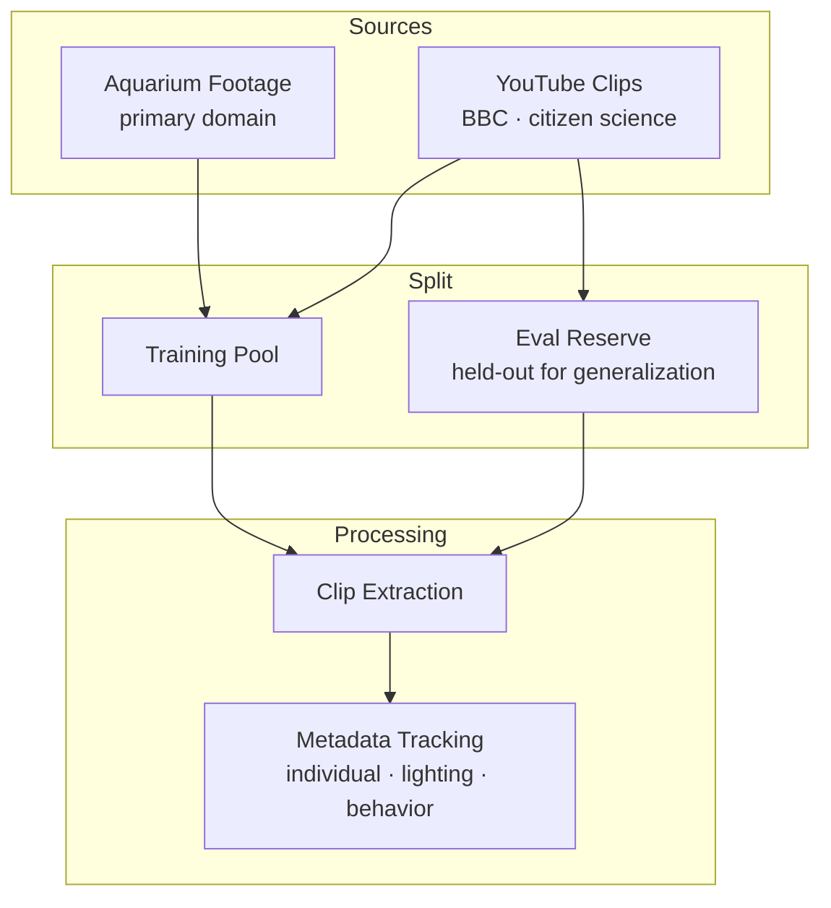
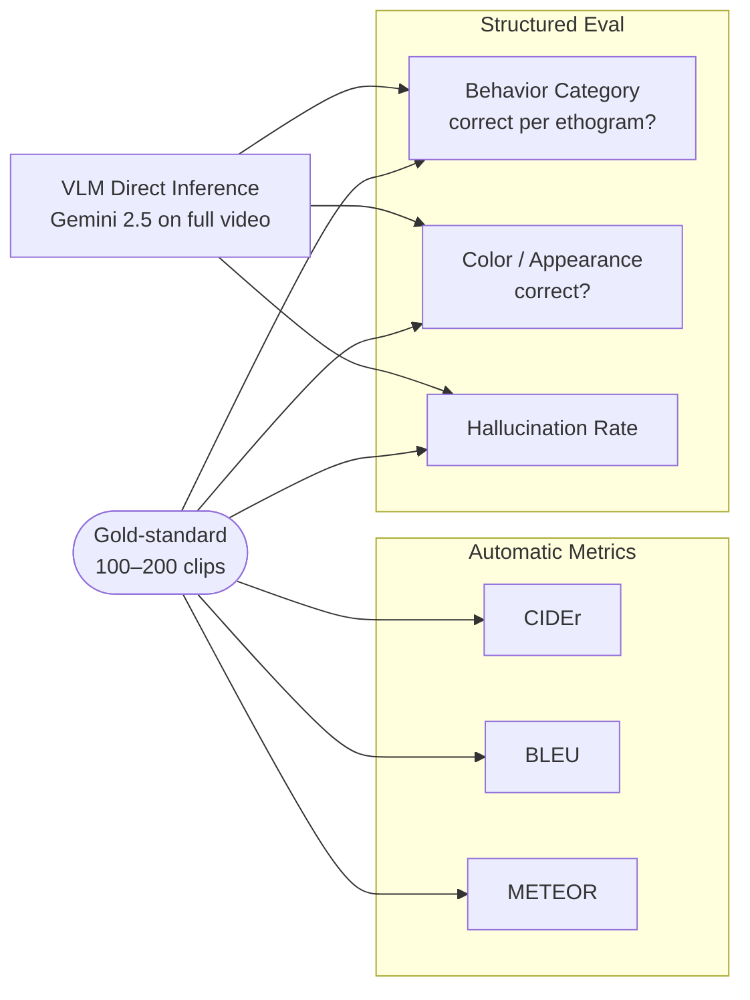
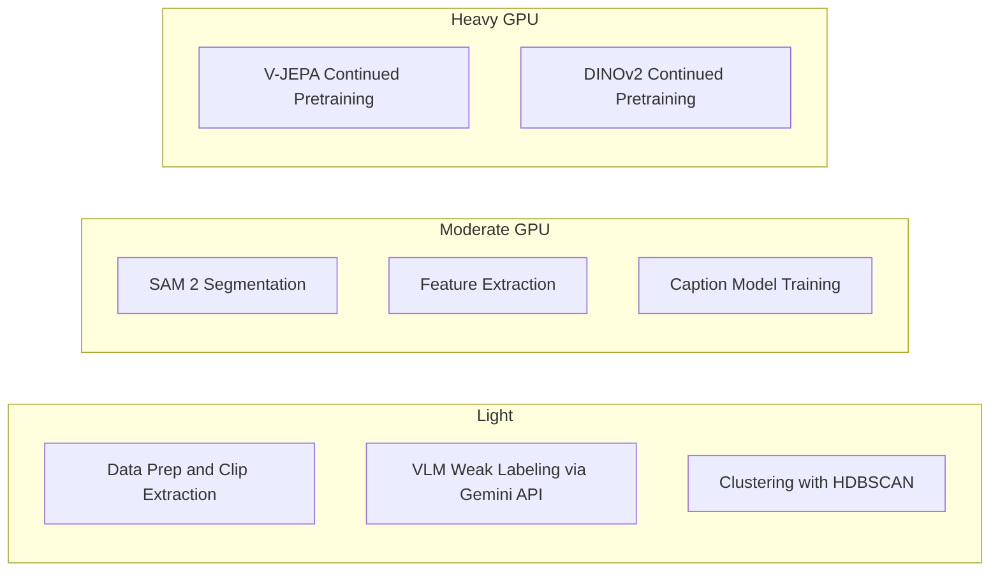
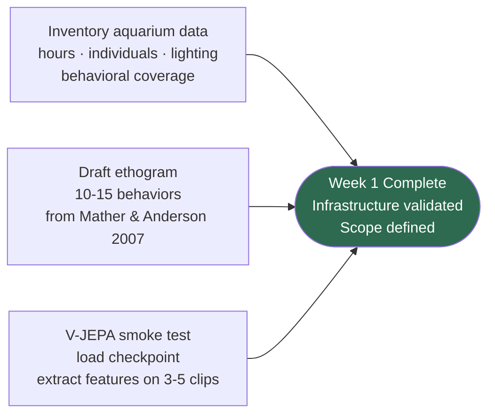
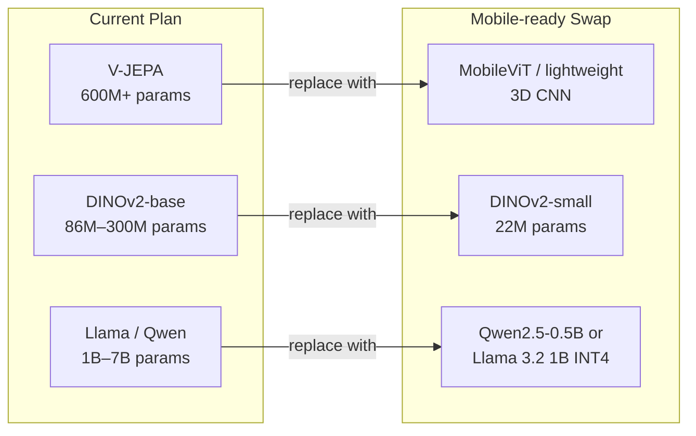
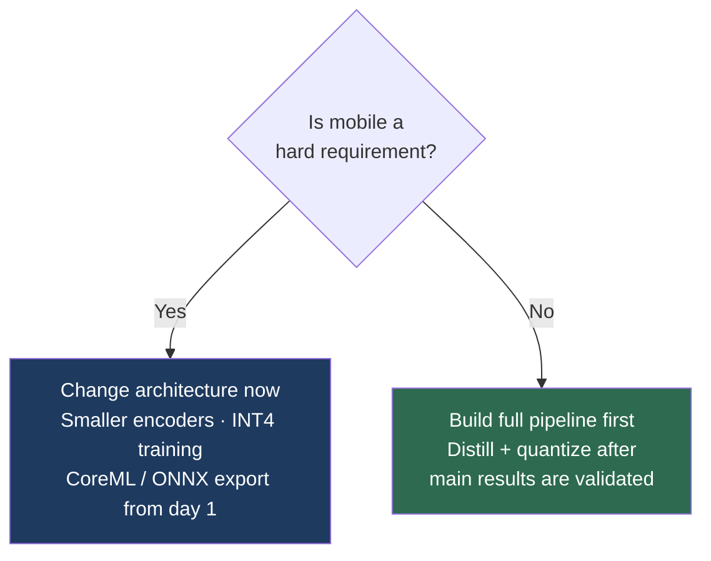

# Cephalopod Activity Video Captioning
### My Plan for Behavioral Caption Generation via Self-Supervised Learning + Vision-Language Models

---

## 1. Project Goal

My goal is to build a system that generates descriptive, behavior-accurate captions for cephalopod (octopus) video clips. I will cover **what the animal is doing**, **how it looks**, and **its posture/context** using a domain-adapted multimodal pipeline.

> I chose captioning as the end goal because it is evaluable, useful, and naturally extensible to affective interpretation later — without getting stuck on "what counts as sentiment."

---

## 2. System Architecture

Here is the full pipeline I will build:

---

## 3. Feature Extraction Strategy

I will use two complementary encoders — one for motion, one for appearance — and concatenate their outputs into a single clip-level feature vector.

---

## 4. Caption Model Architecture

I will follow the **BLIP-2 / LLaVA** architecture — a frozen video encoder connected to a small LLM decoder via a trained projection layer. This is the realistic sweet spot between expressiveness and training cost.

---

## 5. Data Pipeline

I will collect footage from two sources: my aquarium recordings as the primary domain, and YouTube clips (BBC, citizen science) for generalization. I will reserve a portion of the YouTube clips exclusively for evaluation — they will never be used during any training stage.

> I will make this split at data-collection time — not after training — so the generalization claim is clean.

---

## 6. Evaluation Design

I will evaluate my caption model against a gold-standard set of 100–200 clips that I will label carefully by hand. I will use both automatic metrics and a structured behavioral eval, and compare against Gemini 2.5 running directly on the same clips as my baseline.

> I expect the structured eval to be more meaningful than automatic metrics — I will invest extra time setting it up.

---

## 7. 350-Hour Timeline

```mermaid
gantt
    title My 350-Hour Project Plan
    dateFormat  X
    axisFormat  %s h

    section Data
    Data Prep + Ethogram        :a1, 0,   30
    Hand-labeled Eval Set       :a6, 160, 35

    section Vision
    Segmentation Pipeline       :a2, 30,  35
    SSL Pretraining/Adaptation  :a3, 65,  70

    section Analysis
    Behavioral Discovery        :a4, 135, 25
    VLM Weak Labeling           :a5, 135, 30

    section Modeling
    Caption Model Training      :a7, 195, 60

    section Closing
    Evaluation                  :a8, 255, 25
    Writeup + Buffer            :a9, 280, 40
```

| Stage | Hours | What I will produce |
|---|---|---|
| 1. Data prep + ethogram | 30 | Clip corpus, metadata, 10-15 behavior taxonomy |
| 2. Segmentation pipeline | 35 | Per-frame masks for all clips |
| 3. SSL pretraining | 70 | Octopus-adapted V-JEPA + DINOv2 checkpoints |
| 4. Behavioral discovery | 25 | Cluster map of behavioral structure |
| 5. VLM weak labeling | 30 | 1000-3000 noisy training captions |
| 6. Hand-labeled eval set | 35 | 100-200 gold-standard captions |
| 7. Caption model training | 60 | Trained encoder-decoder caption model |
| 8. Evaluation | 25 | Metrics + behavioral accuracy report |
| 9. Writeup + buffer | 40 | Final paper/report |
| **Total** | **350** | |

---

## 8. Compute Requirements

| Stage | Hardware | Est. GPU Hours |
|---|---|---|
| SAM 2 segmentation | 1× A100 40GB | 10–15 h |
| V-JEPA pretraining | 4× A100 80GB | 40–60 h |
| DINOv2 pretraining | 2× A100 80GB | 15–25 h |
| Feature extraction | 1× A100 40GB | 5–8 h |
| Caption model training | 2× A100 80GB | 15–25 h |
| Evaluation | 1× A100 40GB | 2–4 h |
| VLM weak labeling | API only | — |
| **Total GPU hours** | | **~87–137 h** |

### My key compute decisions

- I will run V-JEPA and DINOv2 pretraining with multi-GPU cloud jobs — a single A100 would take days and waste money on idle time.
- I will cache everything to disk (masks, feature vectors, VLM captions) so I never have to rerun an expensive stage from scratch.
- I will use bf16 / mixed precision throughout to halve memory footprint with negligible accuracy loss.
- VLM labeling has no local GPU cost — Gemini 2.5 API handles it.

---

## 9. Key Risks

Risk score = Likelihood × Impact (1–5 scale each)

| Risk | Likelihood | Impact | Score | How I will mitigate it |
|---|---|---|---|---|
| VLM captions too generic | 4 | 4 | **16** | I will use few-shot prompting with ethogram examples and spot-check 5% before training |
| SAM 2 fails on camouflage | 4 | 3 | **12** | I will build a manual correction UI and filter by confidence score |
| SSL adaptation is a wash | 3 | 4 | **12** | I will test frozen vs. fine-tuned features early in Stage 3 before committing 70 hours |
| Weak generalization claim | 2 | 5 | **10** | I will reserve YouTube clips for eval at collection time, not after |
| Training divergence | 3 | 3 | **9** | I will monitor loss curves early and reduce learning rate if instability appears |

---

## 10. First Week Actions

I will run these three things in parallel to validate my infrastructure and define my scope before committing to the full pipeline.

---

## 11. Running on Mobile Devices

If I want to run caption generation on a mobile device during inference, I will need to make deliberate architectural changes. The current pipeline is optimised for accuracy on a GPU cluster — not for a phone with 1-2GB of available RAM.

### What needs to change

### Deployment target by platform

| Platform | Runtime | Format |
|---|---|---|
| iOS | Apple Neural Engine | CoreML |
| Android | Snapdragon NPU | ONNX Runtime Mobile / TFLite |

### Tradeoffs

| Decision | Accuracy impact | What I gain |
|---|---|---|
| MobileViT instead of V-JEPA | Weaker motion modeling — subtle behaviors harder to caption | Fits in mobile memory |
| DINOv2-small instead of DINOv2-base | Slightly less precise appearance features | ~4× smaller model |
| Qwen2.5-0.5B INT4 instead of Llama 7B | Shorter, simpler captions — less fluent | Runs on-device in ~800MB |
| Quantization-aware training (INT4) | Minor accuracy loss if trained correctly | Required for real-time inference |
| Single encoder instead of V-JEPA + DINOv2 | Loses complementary motion+appearance fusion | Halves encoder footprint |

### The key decision I need to make now

If mobile is a **hard requirement**, I need to change my architecture before I start training — picking the smaller encoder variants during SSL adaptation and training with quantization-aware training from the start. Trying to compress the full-accuracy model after training will cost significant caption quality and likely require retraining.

If mobile is a **stretch goal**, I will build the full pipeline first, then distill and quantize a mobile version as a separate stage after the main results are in.

---

## References

- Mather & Anderson (2007) — cephalopod behavioral repertoire
- Borrelli et al. — octopus ethogram baselines
- V-JEPA / V-JEPA 2 — Meta AI video joint-embedding predictive architecture
- DINOv2 — Meta AI self-supervised vision transformer
- SAM 2 — Meta AI Segment Anything Model for video
- BLIP-2 / LLaVA — projection-based multimodal captioning architectures
