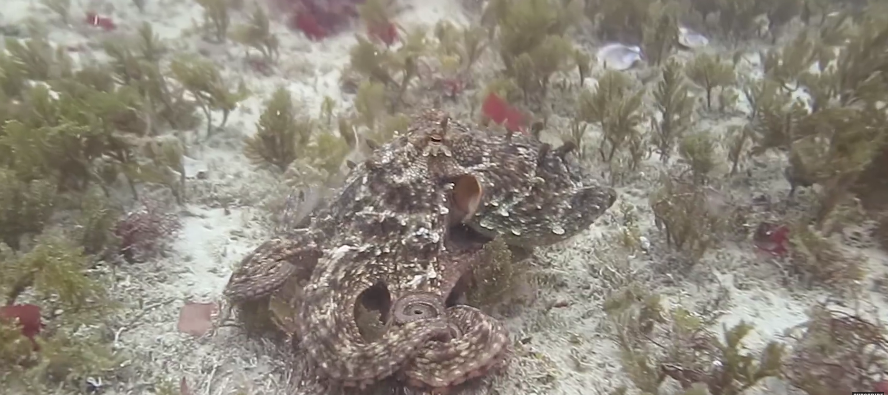
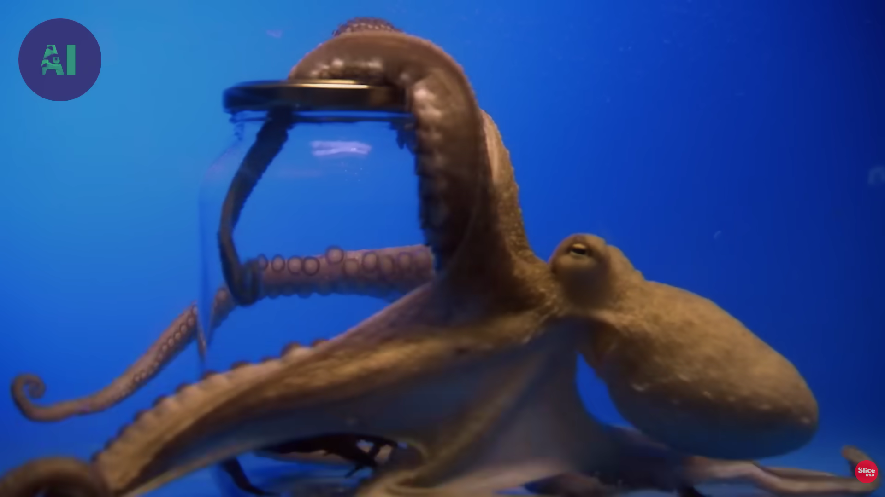
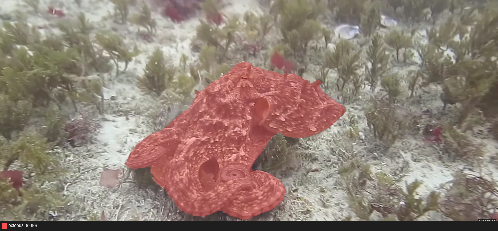
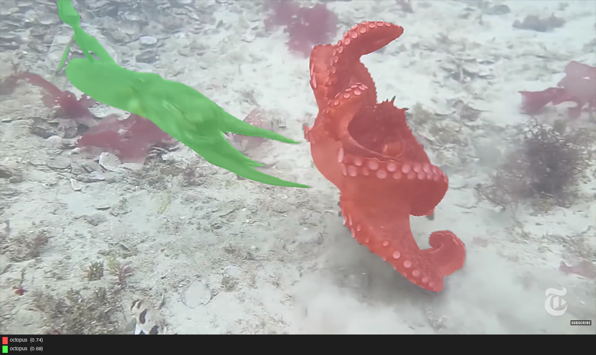
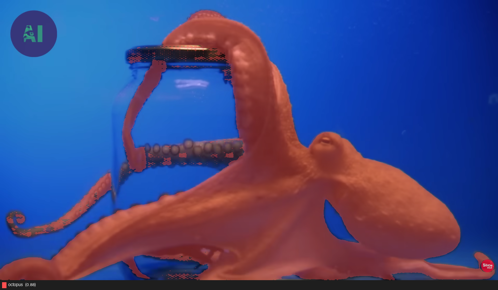
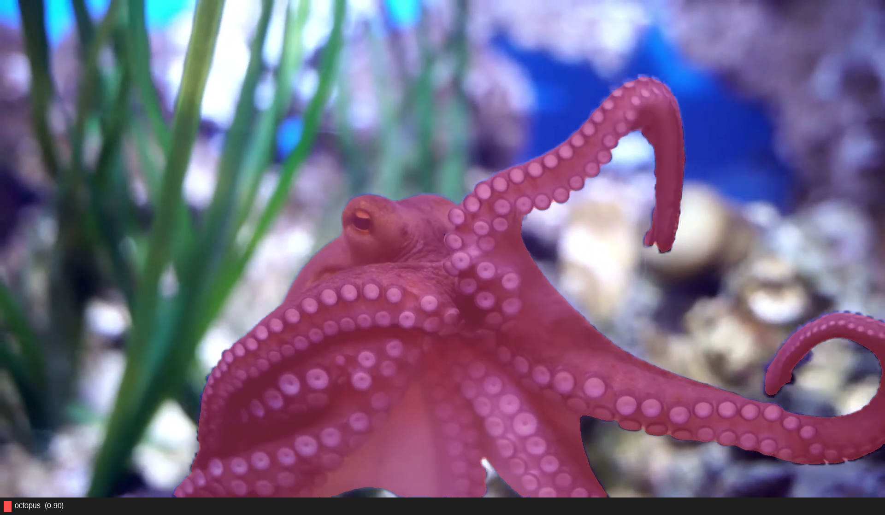
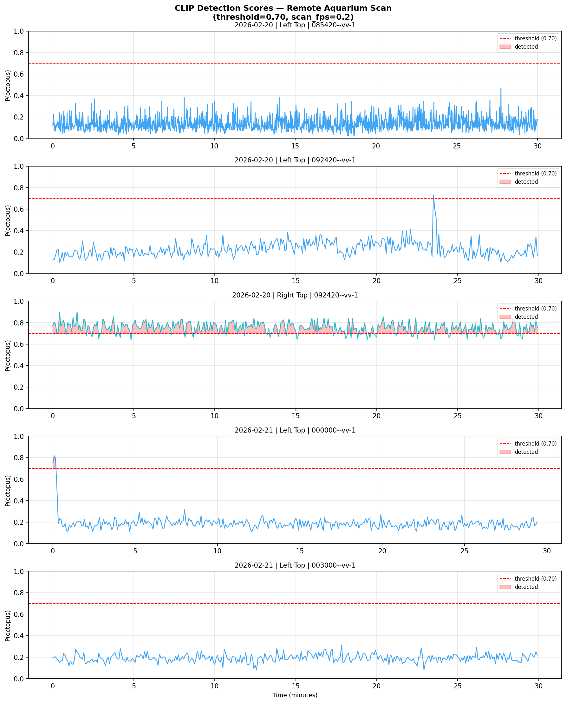

# Cephalopod Behavioral Captioning — Status Report
**Project:** *O. vulgaris* (Nity) Behavioral Analysis  
**Date:** 2026-06-06  
**Author:** Siddharth Raj

---

## 1. Project Goal

Build a pipeline that takes aquarium footage of octopus Nity (*O. vulgaris*) and outputs:
- Confirmed clip segments where the octopus is visibly present
- Behavioral labels (ethogram categories) via unsupervised clustering
- Descriptive captions generated by a fine-tuned vision-language model

The pipeline runs end-to-end: **Detection → Feature Extraction → Clustering → Labeling → Caption Model**

---

## 2. What We've Built

### Stage 1 — Detection Pipeline

Two detection approaches for identifying octopus presence in 30-minute, 658 MB remote videos without downloading them in full.

#### Approach A: CLIP Zero-Shot Scoring

CLIP (ViT-B/32) streams frames via ffmpeg HTTP at 0.2 fps and scores each frame against two text prompts:

```
"an octopus in an aquarium tank"              → P(octopus)
"empty aquarium tank with rocks and no animals"
```

Key decisions:
- **MPS support** (Apple Silicon GPU) for inference
- **ffmpeg pipe** instead of cv2 seeking — 30× faster (4.5 min vs 30+ min for 6 cameras on one video)
- **6 cameras in parallel threads**, CLIP inference serialized with a lock
- **Majority vote**: ≥ 2/6 cameras must detect to confirm a timestamp
- **Threshold = 0.70**, **min\_duration = 30 s** to filter brief human walk-bys

#### Approach B: GroundingDINO Bounding-Box Detection

Zero-shot detector returning bounding boxes for the query `"octopus"`. More spatially precise than CLIP. Confirmed working at **2.19 s/frame** on CPU (custom CUDA ops are not compiled for MPS, so GPU path unavailable on Mac).

---

### Stage 2 — Sample Frame Corpus

28 reference frames collected from public octopus videos, covering key behavioral states. These validate the segmentation pipeline and will seed the hand-labeled eval set.

**Example frames:**

| Camouflage / resting | Locomotion / hunting | Tool use |
|---|---|---|
|  |  |  |

| Aquarium foraging | Alert posture | Open water |
|---|---|---|
|  |  |  |

---

### Stage 3 — Segmentation (Sample Corpus)

GroundingDINO + SAM-based segmentation run on all 28 reference frames. The octopus body mask is extracted per frame with per-class confidence scores.

**Raw frame → Segmentation mask:**

| Behavior | Raw frame | Segmented |
|---|---|---|
| Camouflage resting |  |  |
| Hunting / locomotion |  |  |
| Tank / tool use |  |  |
| Alert posture |  |  |

Segmentation correctly isolates the octopus body across cryptic camouflage, high-motion hunting scenes, and close-up aquarium shots.

---

### Stage 4 — Remote Aquarium Scan

Scanned the live remote server (`repo.octopus-intelligence.org/public`) for subject session `O-vulgaris-Nity-2026-2-20--`, 6 cameras per recording.

**CLIP detection scores across scanned timestamps:**



**Findings:**

| Camera | Baseline | Notes |
|---|---|---|
| Left Top (0854, 0924) | Low (~0.15) | **Reliable — low bias** |
| Right Top (0924) | Persistently high (~0.85) | **Per-camera bias — always fires** |
| Left Top (2026-02-21, early) | ~0.50 then drops | Early morning — octopus inactive |

Right Top, Right Back, and Right Right cameras have a persistent baseline bias above threshold and cannot be used as primary signal. **Left Top and Right Front are the reliable cameras.**

---

### Stage 5 — Downloaded Segments

Confirmed and downloaded segments for timestamp `092420` (2026-02-20, 09:24 AM):

```
data/aquarium/2026-02-20/092420--vv-1/
├── Left_Top_1400_1445.mp4
├── Right_Back_1400_1445.mp4
├── Right_Front_1400_1445.mp4
├── Right_Left_1400_1445.mp4
├── Right_Right_1400_1445.mp4
└── Right_Top_1400_1445.mp4
```

⚠️ Detection at t = 1400–1445 s corresponds to a human aquarist entering the frame, not Nity. This is a known false-positive class. The `min_duration = 30 s` filter reduces but does not eliminate it.

---

## 3. Known Issues & Fixes

| Issue | Root Cause | Fix Applied |
|---|---|---|
| cv2 frame seeking: 30+ min per video | Decodes all intermediate frames | Switched to ffmpeg pipe at 0.2 fps |
| Right Back / Right Right always detect | Per-camera baseline bias | Use Left Top + Right Front only |
| Human walk-bys trigger detection | CLIP is motion-sensitive, not species-specific | `min_duration = 30 s` |
| GroundingDINO parallel scan dies silently | ProcessPoolExecutor + CPU autocast conflict | Not yet resolved; fallback to sequential |
| Right Right audio codec (pcm\_alaw) fails | ffmpeg `-c copy` rejected for that stream | `-c:v copy -c:a aac` re-encodes audio |

---

## 4. Data State

| Location | Contents | Status |
|---|---|---|
| `octo-images/` | 28 reference frames (YouTube) | ✅ Complete |
| `segmented-output/` | 28 segmented frames with masks | ✅ Complete |
| `data/clips/` | Extracted frame sequences (YouTube corpus) | ✅ Complete |
| `data/phase2/scores/` | CLIP score arrays (.npz) — 5 remote scans | ✅ Complete |
| `data/aquarium/2026-02-20/092420--vv-1/` | 6 × 45 s segments | ⚠️ Human FP |
| Confirmed octopus segments | — | ❌ 0 confirmed |

---

## 5. Next Steps

### Immediate — get confirmed octopus data

1. Re-run scanner on **09:00–17:00 window** for 2026-02-20, **Left Top + Right Front only**
2. Raise `min_duration` to **60 s** to further suppress human walk-bys
3. Manually inspect the Left Top score spike at t ≈ 23 min in the 0924 scan — best unverified candidate

### Medium term — once ≥ 10 confirmed clips

4. **DINOv2 feature extraction** — `dinov2_vitb14`, 768-d vectors per confirmed clip
5. **Clustering** — KMeans / HDBSCAN on PCA-reduced features
6. **Manual label 3–5 cluster representatives** — map to ethogram categories
7. **Label propagation** to all clips in each cluster

### Long term

8. Train caption model (BLIP-2 / LLaVA architecture) on labeled clips
9. Evaluate against 100–200 gold-standard hand-labeled clips
10. Optional: distill to mobile model for field deployment

---

## 6. Full Pipeline

```
Remote Server (6 TB footage, 6 cameras)
        │
        ▼  ffmpeg HTTP stream at 0.2 fps
┌──────────────────────────┐
│  CLIP scanner            │  ← 6 parallel threads
│  threshold = 0.70        │  ← majority vote ≥ 2/6
│  min_duration = 30 s     │
└──────────────────────────┘
        │ confirmed timestamps
        ▼  ffmpeg segment download
┌──────────────────────────┐
│  data/aquarium/          │  ← one folder per timestamp
│  6 × .mp4 per folder     │  ← all cameras together
└──────────────────────────┘
        │
        ▼
┌──────────────────────────┐
│  DINOv2 feature extract  │  ← 768-d per clip
│  PCA + clustering        │  ← HDBSCAN / KMeans
│  Manual labeling         │  ← 3-5 reps per cluster
└──────────────────────────┘
        │
        ▼
┌──────────────────────────┐
│  Caption model           │  ← encoder → projection → LLM
│  (BLIP-2 / LLaVA style) │
└──────────────────────────┘
        │
        ▼
  "Octopus resting in den, arms tucked,
   skin texture matching rocky substrate"
```
