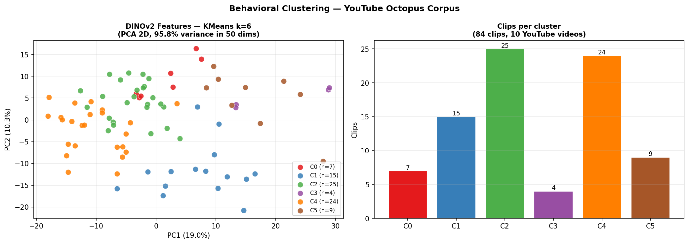
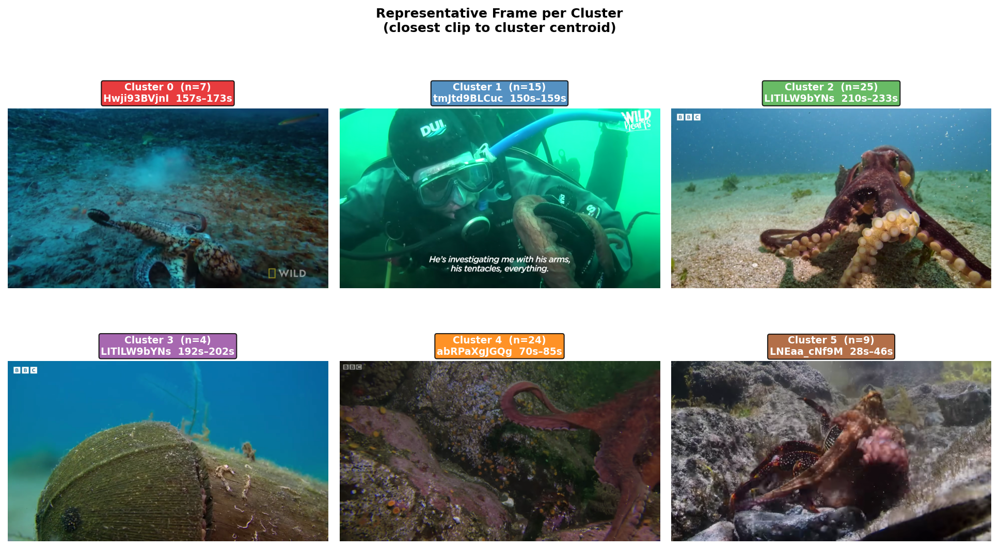

# Cephalopod Behavioral Captioning — Status Report
**Project:** *O. vulgaris* (Nity) | **Date:** 2026-06-06 | **Author:** Siddharth Raj

---

## Goal
Detect octopus presence in live aquarium footage → extract clips → cluster by behavior → generate captions.

---

## What's Built

| Stage | Status | Detail |
|---|---|---|
| CLIP detection | ✅ | Streams remote 658MB videos at 0.2fps, threshold=0.70, 6-camera majority vote |
| GroundingDINO detection | ✅ | Bounding-box detection, 2.19s/frame, CPU-only on Mac |
| Frame corpus (YouTube) | ✅ | 28 reference frames, segmentation masks generated |
| Remote aquarium scan | ✅ | 5 camera timelines scanned, scores saved |
| Downloaded segments | ⚠️ | 1 timestamp (6 × 45s clips) — flagged as human false positive |
| DINOv2 feature extraction | ✅ | 84 clips × 768-d, 10 YouTube videos |
| KMeans clustering (k=6) | ✅ | 84 clips grouped into 6 behavioral clusters |
| Confirmed octopus segments | ❌ | 0 confirmed from aquarium footage |

---

## Sample Frames & Segmentation

| Raw | Segmented | Raw | Segmented |
|---|---|---|---|
|  |  |  |  |
| Camouflage | | Hunting | |
|  |  |  |  |
| Tool use | | Alert posture | |

---

## CLIP Detection Scores (Remote Aquarium)

**Key finding:** Right Top / Right Back / Right Right cameras have persistent high baseline scores (~0.85) regardless of octopus presence — camera bias, not detection. Reliable cameras: **Left Top** (mean ≈ 0.15) and **Right Front** (mean ≈ 0.12).

---

## Behavioral Clustering (YouTube Corpus)

DINOv2 ViT-B/14 → PCA 768→50 dims (95.8% variance) → KMeans k=6 on 84 clips from 10 videos.

**Representative frame per cluster:**

| Cluster | n | Likely behavior |
|---|---|---|
| C0 | 7 | Resting near substrate |
| C1 | 15 | Human interaction / arm extension |
| C2 | 25 | Locomotion / open-substrate foraging |
| C3 | 4 | Denning / hiding |
| C4 | 24 | Active foraging, chromatophore display |
| C5 | 9 | Arms spread, hunting / threat display |

> Labels are preliminary — manual review of 3–5 reps per cluster is the next step.

---

## Next Steps

1. Re-scan aquarium footage, **Left Top + Right Front only**, 09:00–17:00, `min_duration=60s`
2. Manually label cluster representatives against ethogram
3. Run DINOv2 extraction on confirmed aquarium clips once available
4. Train caption model once ≥10 labeled clips exist
