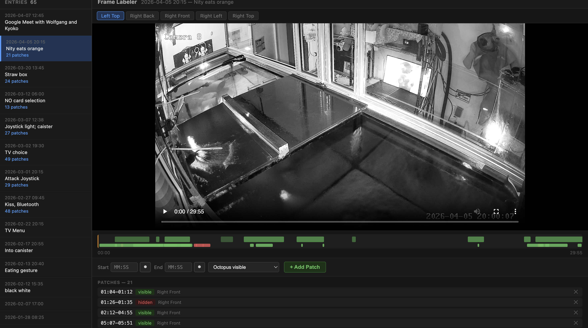
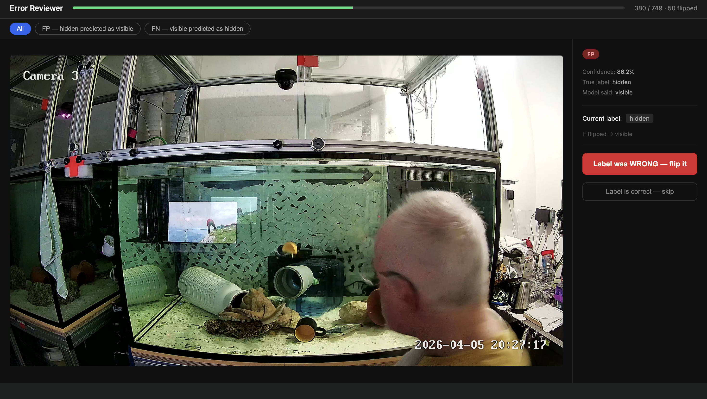

# Cephalopod Behavioral Captioning — Week of June 16, 2026
**Project:** *O. vulgaris* (Nity) Behavioral Analysis  
**Period:** 2026-06-16 to 2026-06-19  
**Author:** Siddharth Raj

---

## Overview

Built and trained a binary classifier to detect whether Nity (*O. vulgaris*) is visibly present in a frame. Pipeline: manual frame labeling via custom UI → CLIP feature extraction → MLP classifier. Achieved **98.1% test accuracy**.

---

## 1 — Frame Labeling UI (`ui/labeler.py`)

Built a custom web-based labeling tool to annotate time patches from the ethogram videos as `visible` (octopus present) or `hidden` (octopus not visible). Runs locally at `http://localhost:8001`.

**How it works:**
- Loads `data/ethogram_index.json` — all indexed events with camera URLs
- Streams video directly from the remote server (`repo.octopus-intelligence.org`) — no full download needed
- User scrubs through the video timeline and marks time windows as visible/hidden
- Patches saved in real time to `data/octopus_patches.json`

**Screenshot — Labeler UI:**

*(screenshot: `notes/ui_labeler.png` — take with Cmd+Shift+4 on http://localhost:8001)*

**Labeled dataset:**
- 239 patches across 29 unique videos
- 154 visible patches, 85 hidden patches

---

## 2 — Frame Extraction (`phase2/extract_frames.py`)

Extracted 1 JPEG frame per second from each labeled time window using `ffmpeg`. Frames saved to `data/frames/visible/` and `data/frames/hidden/`.

**Class imbalance:** 3,750 visible vs 1,636 hidden (~2.3:1 ratio). Addressed by oversampling the hidden class with augmentation:

| Augmentation | Description |
|---|---|
| Horizontal flip + brightness/contrast jitter | Copy 1 per hidden frame |
| Gaussian noise + random crop+resize | Copy 2 per hidden frame |

Script: `phase2/augment_hidden.py` → saves to `data/frames/hidden_aug/`

**Final dataset:**

| Class | Frames |
|---|---|
| visible | 3,750 |
| hidden (original) | 1,636 |
| hidden (augmented) | 3,272 |
| **Total** | **8,658** |

---

## 3 — Misclassification Review UI (`ui/review_errors.py`)

After each training run, misclassified frames were reviewed in a second UI at `http://localhost:8002`. Shows FP (hidden predicted as visible) and FN (visible predicted as hidden) one at a time with keyboard shortcuts to flip or skip.

**Key design:** Flipping a label moves the JPEG between `visible/` and `hidden/` folders and updates `manifest.csv` directly — `patches.json` is never touched, so corrections are at the individual frame level.

**Screenshot — Review UI:**

*(screenshot: `notes/ui_review.png` — take with Cmd+Shift+4 on http://localhost:8002)*

---

## 4 — Model Training & CLIP Comparison

### Exp 20 — CLIP Zero-Shot Baseline (`phase2/exp20_clip_zeroshot.ipynb`)

First we tested plain CLIP with no training — just text-image cosine similarity between 4 prompt pairs and each frame. No learned weights, no fine-tuning.

Best prompt pair tested:
- **visible** → `"octopus present, arms extended, aquarium security camera"`
- **hidden** → `"octopus absent, empty tank, aquarium security camera"`

| Metric | Value |
|---|---|
| Test accuracy | 55.7% |
| ROC-AUC | **0.49** (random chance) |
| Visible recall | 0.23 — misses 77% of octopus frames |
| Hidden recall | 0.81 — biased toward predicting hidden |

CLIP zero-shot essentially fails — ROC-AUC of 0.49 means it has no real discriminative signal. The model defaults to predicting "hidden" regardless of content.

---

### Exp 17 — CLIP Linear Probe (`phase2/exp17_clip_classifier.ipynb`)

Frozen CLIP ViT-B/32 features (512-dim) → single linear layer (1,026 params). Trained with class weights to handle imbalance.

| Metric | Value |
|---|---|
| Test accuracy | 88.8% |
| Hidden F1 | 0.90 |
| Visible F1 | 0.87 |
| Misclassified | 194 / 1,732 (11.2%) |

Solid baseline — training the linear layer recovers 33% from zero-shot. But the single linear layer underfits the non-linear structure in the 512-dim feature space.

---

### Exp 18 — CLIP MLP (`phase2/exp18_clip_mlp.ipynb`)

Same frozen CLIP features → MLP head: `512 → 256 → ReLU → Dropout(0.3) → 64 → ReLU → Dropout(0.3) → 2` (147,906 params).

| Metric | Value |
|---|---|
| Test accuracy | **98.1%** |
| Hidden F1 | **0.98** |
| Visible F1 | **0.98** |
| Misclassified | ~35 / 1,732 |

No overfitting — val accuracy tracked train accuracy throughout all 50 epochs.

Checkpoint: `weights/clip_mlp_best.pt`

---

### Full CLIP Comparison

| Model | Params | Accuracy | Hidden F1 | Visible F1 | ROC-AUC |
|---|---|---|---|---|---|
| CLIP zero-shot (exp20) | 0 | 55.7% | 0.67 | 0.32 | 0.49 |
| CLIP + Linear probe (exp17) | 1,026 | 88.8% | 0.90 | 0.87 | — |
| CLIP + MLP 512→256→64 (exp18) | 147,906 | **98.1%** | **0.98** | **0.98** | — |

**Key takeaway:** CLIP's generic visual-semantic features carry almost no zero-shot signal for octopus presence in aquarium footage (ROC-AUC ≈ random). The full 42.4% accuracy gain (55.7% → 98.1%) comes from training on our labeled dataset. This validates the investment in the labeling UI and the label correction review workflow.

---

## 5 — Inference Benchmark (`phase2/exp19_inference_benchmark.ipynb`)

End-to-end latency on Apple M5 (MPS), measured over 100 runs:

| Stage | Mean (ms) | Std (ms) |
|---|---|---|
| Image load from disk | 13.9 | 3.1 |
| CLIP preprocess | 18.1 | 1.6 |
| CLIP encode (ViT-B/32) | 9.0 | 3.0 |
| MLP forward | 0.6 | 0.2 |
| **Total end-to-end** | **41.6** | **5.5** |

**Throughput: 24 images/second** (single image, no batching)

Real-time capability:

| Camera FPS | Headroom | Status |
|---|---|---|
| 1 fps | 24× | ✓ real-time |
| 5 fps | 4.8× | ✓ real-time |
| 10 fps | 2.4× | ✓ real-time |
| 25 fps | 1.0× | ✗ borderline |
| 30 fps | 0.8× | ✗ too slow |

**With batching** (pre-loaded images, no disk I/O):

| Batch size | Per-image (ms) | Throughput |
|---|---|---|
| 1 | 4.7 | 211 img/s |
| 4 | 3.3 | 306 img/s |
| 8 | 2.3 | 432 img/s |
| 16 | 2.2 | 462 img/s |
| 32 | 2.0 | **493 img/s** |

The bottleneck is disk I/O + CLIP preprocessing (31ms / 75% of total), not the model. Pre-buffering frames pushes throughput to 400+ img/s — well beyond real-time for any aquarium camera.

---

## 6 — Next Steps

- **Switch backbone to DINOv2 ViT-B/14** — better spatial/texture features (768-dim, 14×14 patches), expected to push accuracy above 98.1%
- **Per-frame label review pass** — review UI already supports frame-level corrections
- **Run classifier on full aquarium footage** — scan 30-min segments at 1 fps, output presence timeline per camera
- **Temporal context** — stack features from t-1, t, t+1 frames to improve classification of partially-visible or transitioning frames
