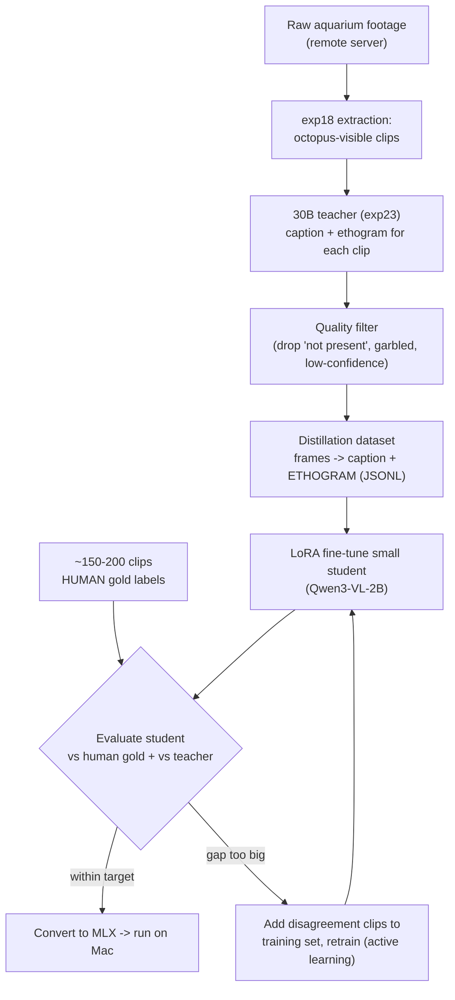

# Training Plan — Distilling a Small Octopus-Only Captioner

**Goal:** Replace the 30B teacher with a **small model that runs locally** (Mac / MLX) but produces the same quality of output — a caption of what Nity is doing + an ethogram label — **only on octopus aquarium footage**.

**Method:** Sequence-level knowledge distillation. The 30B Qwen3-VL (teacher, in `exp23`) auto-labels a large octopus-only dataset; a small VLM (student) is fine-tuned to imitate it on that narrow domain.

---

## 1. Why a small model can match the 30B here

The 30B is big because it is *general*. We need a model that is an expert on **one narrow distribution** — Nity, this tank, these camera angles, this ethogram. On a narrow slice, a small model can match a large one. The local Qwen2-VL-2B failed *zero-shot* ("called the octopus a fish") — but distillation makes it *see* thousands of correctly-labeled octopus frames, which is exactly what fixes that failure.

---

## 2. Distillation approach

We use **sequence-level (data) distillation**, not logit distillation:
- Logit distillation needs the teacher's internal probabilities and a matching tokenizer — impractical across different model sizes.
- Sequence-level distillation just uses the teacher's **text outputs** as training targets with ordinary cross-entropy. Simple, architecture-agnostic, ideal for a narrow domain.

The teacher's `captions.json` from `exp23` is the seed of dataset **E** — we just need a lot more of it.

---

## 3. Data requirements (the key numbers)

### How many clips
| Tier | Teacher-labeled clips | Use |
|---|---|---|
| Bare minimum (will show benefit) | **~500** | proof of concept only |
| **Recommended target** | **2,000–3,000** | reliable student |
| Ideal | 4,000–5,000 | best quality, rare behaviors covered |
| **Human gold (held out, never trained on)** | **150–200** | honest evaluation + label-quality check |

**Coverage matters more than raw count.** Each ethogram behavior you actually care about should have **≥ 30–50 examples**. With ~10–12 behaviors realistically present in this footage, that alone implies ~500+ clips before redundancy. Rare behaviors (inking, swimming) may be near-absent — accept that and report it; don't fabricate coverage.

> We currently have **52 clips** — far too few. **Scaling the dataset is the first and biggest task** (Step 1 below).

### Clip length
- **Recommended: 8–10 seconds** (down from the current 20s).
- Why shorter: a 20s clip often contains *several* behaviors → noisy single labels. An 8–10s clip centered on a motion peak usually shows **one dominant behavior**, which is what we want the student to learn.
- Extract centered on the motion-window peak (the `exp18` / `exp16` pipeline already finds peaks).

### Frame sampling (per clip)
- **6–8 frames**, evenly spaced (~0.75 fps over 10s ≈ 7 frames).
- **Max ~448 px** on the long side (caps token count; the student is small).
- Keep teacher and student on the **same frame-sampling scheme** — the student must see inputs shaped like its training data at inference.

### Data quality filtering (critical — this sets the student's ceiling)
- Drop clips the teacher marks `not present` (or keep a capped number as explicit negatives).
- Drop garbled / off-format teacher outputs.
- Optional but recommended: **self-consistency** — sample the teacher 2–3× per clip; keep clips where the ethogram label agrees. Inconsistent clips are either ambiguous or hard — route to human review, don't train on them blindly.

---

## 4. Student model

**Primary choice: `Qwen3-VL-2B-Instruct`** (or 4B if 2B underperforms).
- Same family as the teacher → identical prompt format and chat template, so labels transfer cleanly.
- LoRA fine-tunes on a single A100; converts to **MLX 4-bit** to run on the Mac.

**Alternatives:**
- Captions-only, even smaller: **Florence-2 (0.23–0.77B)** or **SmolVLM-2B**.
- **Classifier-only shortcut** (if you later decide you only need the ethogram label, not the caption): skip the VLM entirely — extract CLIP/DINOv2 frame features + a small MLP head trained on the teacher's labels. This is the exact pattern as the Phase-1 presence classifier, is a few MB, and runs in ms on the Mac. Keep this in your back pocket.

---

## 5. Step-by-step plan

### Step 1 — Scale the clip dataset (biggest effort)
Re-run `exp18`-style extraction over **all** indexed events and motion windows (not just the top 3 per event), lower the visibility threshold slightly, and cut **8–10s** clips at motion peaks. Target **2,000–3,000** octopus-visible clips. Store with the same manifest schema.

### Step 2 — Teacher auto-labeling (on Colab A100)
Run the `exp23` 30B over every clip with the structured `CAPTION:` / `ETHOGRAM:` prompt + self-consistency. Apply the Step-3 quality filter. Output a **JSONL distillation file**: each line = `{frames: [...], prompt, target_text}`.

### Step 3 — Human gold set (parallel, do early)
Hand-label **150–200** clips with the behavior-labeling UI (from `plan-phase2.md`), stratified across behaviors. **Hold these out of training entirely.** This is the only honest yardstick.

### Step 4 — LoRA fine-tune the student (Colab A100)
Train Qwen3-VL-2B on the JSONL (recipe in §6). Save adapter + merged weights.

### Step 5 — Evaluate
Score the student (§7) against the human gold and against the teacher. Decide via the gate.

### Step 6 — Deploy
Convert the merged student to **MLX 4-bit**; wire it into a local script mirroring `exp22` (frames in → caption + ethogram out). Benchmark latency like `exp19`.

---

## 6. Training recipe (starting hyperparameters)

| Setting | Value | Note |
|---|---|---|
| Method | **LoRA** (rank 16–32, alpha 32) | full fine-tune unnecessary for a narrow task |
| Trainable | LLM attention + MLP proj; **freeze vision encoder** | encoder already sees images fine |
| Epochs | 3–5 | watch held-out loss for overfitting |
| LR | 1e-4 (LoRA) | cosine decay, ~3% warmup |
| Batch | 1–2 × grad-accum 8–16 | images are memory-heavy |
| Precision | bf16 | A100 |
| Loss | cross-entropy on target tokens only | mask the prompt/image tokens |
| Max frames | 6–8 @ 448px | must match inference |

Start small, confirm loss drops and a few sample outputs look sane, then scale epochs/data.

---

## 7. Evaluation

- **Ethogram accuracy vs human gold** — coarse 7-way (headline) + fine 19-way (secondary). Confusion matrix.
- **Caption quality** — agreement with teacher (embedding similarity / ROUGE) + human spot-check of ~30 clips for hallucination.
- **Three-way comparison** — student vs teacher (30B) vs the original 2B zero-shot. The story you want: *student ≈ teacher, both ≫ 2B zero-shot.*
- **Deployment metrics** — model size, latency, RAM on the Mac (reuse `exp19` benchmark).

---

## 8. Risks

| Risk | Mitigation |
|---|---|
| **Teacher errors cap the student** — student faithfully copies the 30B's mistakes | Self-consistency filter; human gold to measure the real ceiling; spot-fix worst training labels |
| **Behavior coverage gaps** (inking/swimming rare or absent) | Report per-behavior support; don't claim ethogram-wide accuracy; oversample rare classes if any exist |
| **Multi-behavior clips → noisy labels** | Shorter 8–10s clips centered on motion peaks |
| **Overfitting to camera/background** not behavior | Mix cameras/dates in train; check student isn't just memorizing tank views |
| **Too little data** | Step 1 is non-negotiable — get to ≥1,000 before expecting results |
| **2B still too weak after distillation** | Escalate student to 4B; or fall back to the classifier-only shortcut for the ethogram label |

---

## 9. Definition of done

- ≥ 2,000 teacher-labeled clips (8–10s) + 150–200 human-gold clips.
- A LoRA-fine-tuned Qwen3-VL-2B student running locally on the Mac via MLX.
- Measured: student coarse-ethogram accuracy **within ~5–10% of the 30B teacher** on the human gold set, and far above the 2B zero-shot baseline.
- A short report: dataset size/coverage, student-vs-teacher-vs-zeroshot table, latency/size on Mac, and known failure behaviors.
